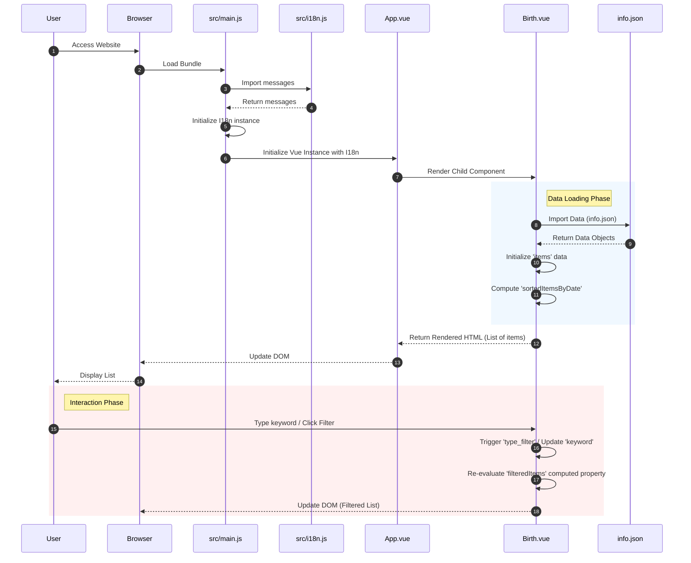

# Project Documentation: The Birth of Websites

## 1. Project Overview
This project, internally named `dateofbirth`, is a Vue.js application that visualizes the founding dates and history of major tech companies, services, and programming languages. It allows users to filter these entities by type, nationality, and era, or search by keyword. The application supports both English and Japanese languages.

## 2. Directory Structure
```
/Users/takumaniwa/thebirthofwebsites/
├── public/              # Static assets (images, flags - served directly)
│   ├── flag/            # Country flag images
│   └── ...              # Logo images
├── src/                 # Source code
│   ├── assets/          # Static assets (processed by Vite)
│   ├── components/      # Vue components
│   │   ├── Birth.vue    # Main logic and display component
│   │   ├── Footer.vue   # Site footer
│   │   └── Header.vue   # Site header
│   ├── App.vue          # Root Vue component
│   ├── i18n.js          # Internationalization configuration
│   └── main.js          # Entry point
├── info.json            # Data source (JSON)
├── index.html           # HTML template
├── package.json         # Dependencies and scripts
├── vite.config.js       # Vite configuration
└── ...
```

## 3. Key Technologies
*   **Vue.js (v3.x):** Frontend framework.
*   **Vue I18n (v11.x):** Internationalization plugin.
*   **Vite:** Build tool and development server.

## 4. Architecture & Processing Flow

The application follows a standard Vue.js client-side rendering architecture. Data is stored statically in `info.json` and loaded by the `Birth.vue` component.

### Sequence Diagram


